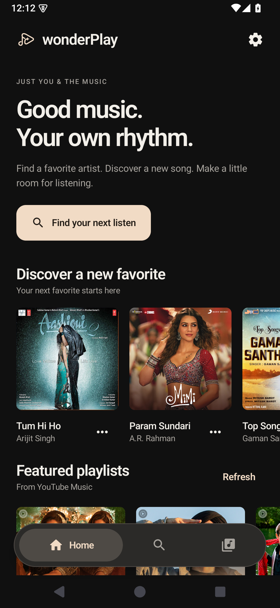
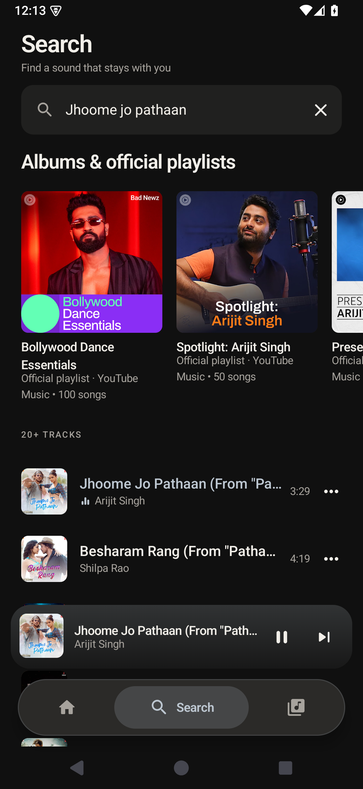
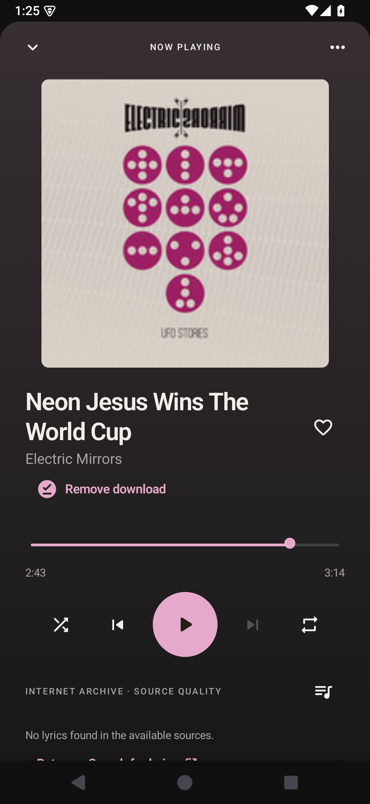

  
  <h1>wonderPlay</h1>
  
<strong>Good music. Your own rhythm.</strong>

  
An Android music player that takes its colors from your music.

  
<a href="https://github.com/johanjosesaju3608/wonderPlay/releases/latest"><strong>Download for Android</strong></a> · <a href="https://github.com/johanjosesaju3608/wonderPlay/issues">Feedback</a> · <a href="PRIVACY.md">Privacy</a>

  
Android 8.0+ · Open source · No account required

 

<table>
  <tr>
    <td></td>
    <td></td>
    <td></td>
  </tr>
</table>

### Made for the way you listen

- **A color for every song.** Album artwork shapes the theme as you listen.
- **Find your next favorite.** Search songs, albums and official playlists, with recommendations on Home.
- **Stay with the lyrics.** Synced lines follow playback and open into a full-screen view.
- **Keep music close.** Floating controls, swipe gestures and background playback.
- **Take eligible music offline.** Private downloads, progress controls and a licensed-music browser in Library.
- **Make it yours.** Favorites, playlists and your own local music.

[See private downloads in action](docs/screenshots/downloads-1.1.0.png)

### Get wonderPlay

Grab the APK from [the latest release](https://github.com/johanjosesaju3608/wonderPlay/releases/latest), open it on your phone and follow Android’s installation prompts. Install over an existing wonderPlay release to keep your library.

### Behind the music

wonderPlay uses YouTube Music for its online catalog and supports your local audio files. Internet Archive supplies licensed recordings for private downloads; download coverage differs from the YouTube catalog. Lyrics come from LRCLIB, with NetEase and lyrics.ovh as fallbacks. Provider availability can vary. wonderPlay is an independent project, unaffiliated with these services.

[Release notes](https://github.com/johanjosesaju3608/wonderPlay/releases) · [Build and contribute](docs/BUILDING.md) · [Architecture](docs/ARCHITECTURE.md) · [Privacy](PRIVACY.md)

Original app code is MIT licensed. The combined app is GPL-3.0-or-later, including NewPipe Extractor. See [licenses and credits](THIRD-PARTY-NOTICES.md).
